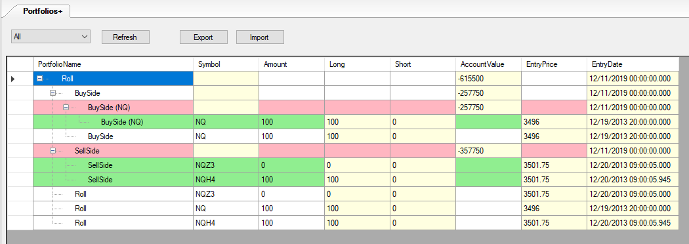

# SmartQuant.Toolkit.Portfolio
OpenQuant软件的人工调仓工具

## 项目需求
在某些情况下会遇到需要人工调整OQ投资组合持仓的情况：
1. 在外部系统中调整了持仓，需要在OQ中维护起来；
2. 老策略下线，新策略上线，持仓需要平移到新策略；
3. OQ或策略的Bug导致持仓没有正确记录需要修正；
4. 其它情况

## 安装
1. 将生成的dll与依赖dll复制到OpenQuant安装目录
2. OpenQuant->Tools->Options->Environment->Custom Windows，然后添加对应dll即可

## 使用
1. 界面CustomWindow->PortfolioWindow

2. 黄色单元格。选中高亮后可以按F2进行编辑
2. 红色行。表示无子投资组合的投资组合，其子节点下挂的全是持仓。可以编辑投资组合的资金
3. 绿色行。表示持仓。可以编辑持仓的多空数量
4. Symbol中的黄色单元格。输入合约代码后可以在当前子节点下添加新持仓。
5. 建议只在红色行与绿色行中的黄色单元格中操作，白色行操作会带来维护上的麻烦。

6. 通过 All(全部)/PortfolioOnly(只显示投资组合)/Position(只显示持仓) Refresh切换显示

7. Export/Import可以导入导出投资组合与持仓

## 注意
1. Long/Short字段编辑前需要提前编辑好EntryPrice(成交价)与EntryDate(成交时间)。部分用户可能在策略中通过Position.Fills来判断今昨，所以EntryDate很重要
2. AccountValue字段编辑前需要提前编辑好EntryDate
3. OpenQuant会在父Portfolio中归集子Portfolio的持仓，同时还可以在父Portfolio中额外添加持仓。建议不要主动在同一节点下出现持仓与投资组合并列的情况。

## 导入/导出
1. 导出成csv文件。记录的顺序为：1投资组合，2子投资组合持仓，3父投资组合持仓
2. 导入记录中为目标持仓表。
	- 先根据1投资组合建立各种节点，
	- 再根据2子投资组合持仓建立持仓，由于OQ框架的机制，会自动归集到父投资组合持仓。
	- 最后到3父投资组合持仓记录时，由于对比后发现持仓相同，所以不调整
3. 可以通过构造csv，生成昨仓与今仓
	- 第一条记录是某合约昨天收盘后的持仓数，昨天的时间
	- 第二条记录是某合约今天收盘后的持仓数，今天的时间
	- 导入后的最终持仓是第二条记录的，OrderManager界面中可以观察到完整的调仓过程

